# Entra Self-Service on Power Platform: solution overview

**Audience:** stakeholders, architects, the Entra ID team and change management.
**Status:** version 1.2. Built and statically checked; it is being tested in the QA tenant.
**In one line:** teams request Entra ID app registrations in a Power App. The request needs two approvals, then a flow creates the registration in minutes, named and tagged to standard.

---

## 1. Problem

Today an app registration is a manual ticket to the Entra ID team.

| Today (manual) | Effect |
|---|---|
| About **10 working days** from request to a usable app registration | Projects wait; teams work around the process, for example by reusing one app for many purposes |
| At least **one person-day** of Entra ID team effort per request (clarifying, creating, exposing the API, roles, enterprise app, group assignments, replying) | The team's time goes to repetitive work, and the queue grows with demand |
| Each engineer builds it slightly differently | Names, tags, owners and settings are inconsistent, so it's hard to tell who owns what |
| Approvals happen in email or ticket comments | The audit trail is scattered, and what was approved isn't tied to what was built |
| Requesters would need Entra admin roles to do it themselves | Not acceptable under least privilege |

**Goal:** requesters self-serve through a simple form. They get the same controls (manager plus Entra ID team approval), the result in minutes after approval, and every object follows the naming and tagging standard. No requester, manager or flow owner needs an Entra admin role.

## 2. Solution at a glance

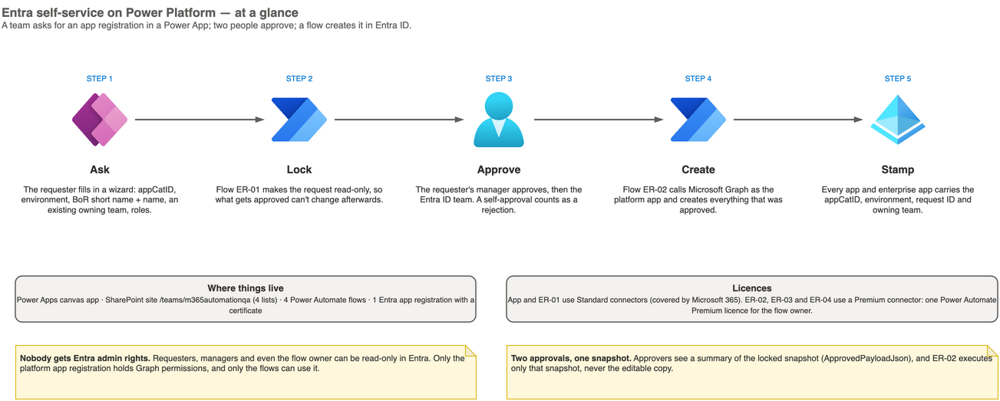

1. **Ask:** the requester fills in a wizard in the Power App.
2. **Lock:** flow ER-01 makes the request read-only, so what is approved can't change afterwards.
3. **Approve:** the requester's manager approves, then the Entra ID team. A self-approval counts as a rejection.
4. **Create:** flow ER-02 calls Microsoft Graph as a dedicated app identity, using a certificate, and creates exactly what was approved.
5. **Stamp:** every object carries appCatID, environment, request ID, owning team and `managedBy`, for audit and for the catalog.

What it supports:

- **New app registration**:
  - name `<AppCatID>-<Env>-<BoR short name>-<free text>`, with a fixed prefix the requester can't edit;
  - redirect URIs, optional claims, app roles, Expose an API (App ID URI and scopes);
  - an enterprise app with *Assignment required* chosen in the form;
  - role assignments to existing groups.
- **Changes to existing apps:** add scopes, add app roles, assign groups to roles, create a missing enterprise app.
- **Add an existing group:** a group created elsewhere becomes pickable once the requester proves they are a member or owner.
- **My requests:** status, approvals and results of the requester's own requests.

Out of scope by design:

- Creating groups: groups are created by another process.
- Adding owners to app registrations or enterprise apps.
- Client secrets: the platform never creates them.

## 3. Architecture

Everything runs in **one Entra tenant**:

- Microsoft 365 services: **Power Apps**, **SharePoint**, **Power Automate**, **Approvals**, **Outlook**.
- **One Entra app registration** with four Graph application permissions and a certificate.
- No Azure subscription, no servers and no custom code to host.

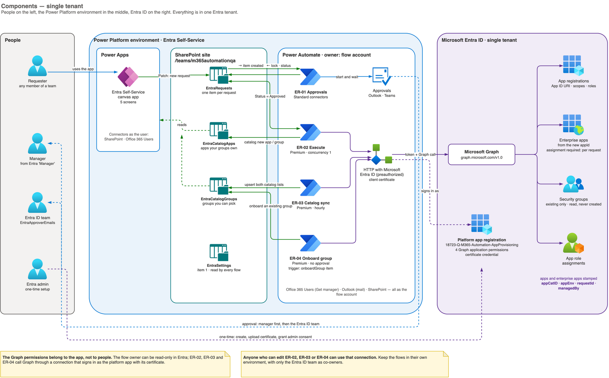

| Component | Role |
|---|---|
| **Power App "Entra Self-Service"** (canvas, 5 screens) | The form and the request tracker. Uses only Standard connectors (SharePoint, Office 365 Users), so users need no extra licence. |
| **SharePoint site** with 4 lists | `EntraRequests` holds one item per request and is the audit trail, with 500 versions. `EntraCatalogApps` and `EntraCatalogGroups` hold what each user may pick. `EntraSettings` holds the configuration. |
| **Power Automate flows** (solution *Entra Self-Service* 1.2) | SP-00 (setup), ER-01 Approvals, ER-02 Execute, ER-03 Catalog sync, ER-04 Onboard group. All are owned by one flow account. |
| **HTTP with Microsoft Entra ID (preauthorized)** connection | Signs in to Graph as the platform app with its certificate. The certificate stays in the connection and is never shown in run history. |
| **Platform app registration** `18723-Q-M365-Automation-AppProvisioning` | The only identity with Graph write rights: `Application.ReadWrite.All` and `AppRoleAssignment.ReadWrite.All`, plus `Directory.Read.All` and `User.Read.All`. |

### 3.1 Who runs as whom

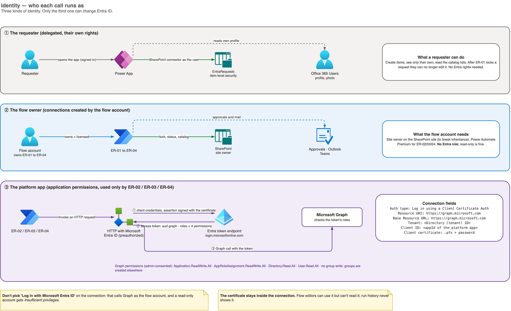

| Identity | Used for | Entra rights |
|---|---|---|
| **Requester** (delegated, in the app) | Creating their own request items and reading the catalog | None |
| **Flow account** (owns the flows and connections) | SharePoint updates, approvals, email | None. Read-only is enough. Needs one Power Automate Premium licence. |
| **Platform app** (certificate, application permissions) | Every Graph call made by ER-02, ER-03 and ER-04 | The 4 Graph permissions above, with admin consent |

### 3.2 Request lifecycle

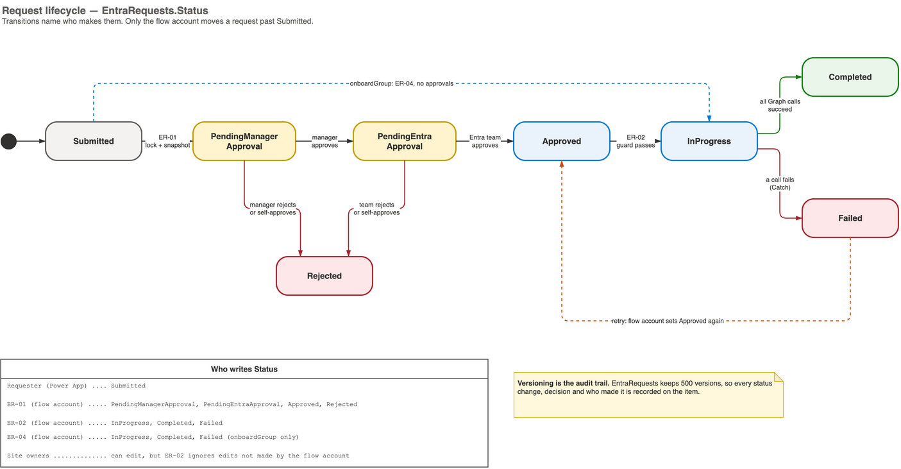

Only the flow account moves a request past *Submitted*. ER-02 runs only when the item was last edited by the flow account **and** both approvals are recorded. A site owner who sets *Approved* by hand cannot trigger it.

## 4. Flows

| Flow | Trigger | What it does | Connectors | Licence |
|---|---|---|---|---|
| **SP-00 Create lists** | Manual, once | Creates the 4 SharePoint lists and their columns. This is the no-script alternative to `provision.ps1`. | SharePoint | Standard |
| **ER-01 Approvals** | A request item is created (not *onboardGroup*) | Locks the item: inheritance broken, requester Read. Snapshots the payload, then gets the manager's approval and the Entra ID team's approval. Treats a self-approval as a rejection. | SharePoint, Office 365 Users, Approvals, Outlook | Standard |
| **ER-02 Execute** | Status = Approved | Runs the guard, then one branch per request type (below). Records the result and emails the requester. On any failure the Catch branch marks the request Failed and lists what was already created. | SharePoint, HTTP with Entra ID, Outlook | Premium |
| **ER-03 Catalog sync** | Every hour | Reads managed apps and onboarded groups from Entra, and refreshes their members and owners in the catalog lists the app uses. Read-only in Entra. | SharePoint, HTTP with Entra ID | Premium |
| **ER-04 Onboard group** | A request item of type *onboardGroup* is created | Finds the group by name or Object ID and checks the requester is a member or owner and that it is a security group. Then adds it to the catalog. No approval; read-only in Entra. | SharePoint, HTTP with Entra ID | Premium |

### 4.1 Submit and approve (ER-01)

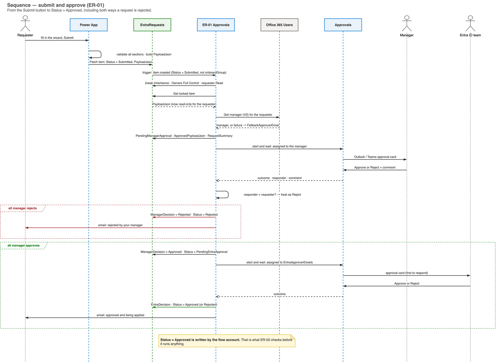

### 4.2 Create an app registration (ER-02)

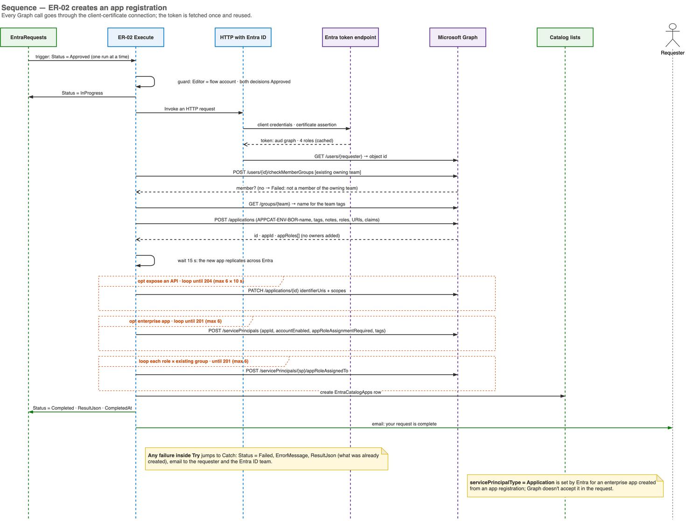

Key steps:

1. **Membership check.** The requester must be a member of the chosen owning team, an existing group.
2. **Create the app registration** with the enforced name, tags and notes. It gets no owners.
3. **Wait 15 seconds** for the new app to replicate in Entra.
4. **Expose an API**, retrying up to 6 times while the app replicates.
5. **Create the enterprise app** from the new app's `appId`, with `accountEnabled` and *Assignment required* as requested. Entra sets the service principal type to Application itself.
6. **Assign existing groups to app roles**, each assignment retried up to 6 times.
7. **Catalog the new app** and **email the requester** the IDs.

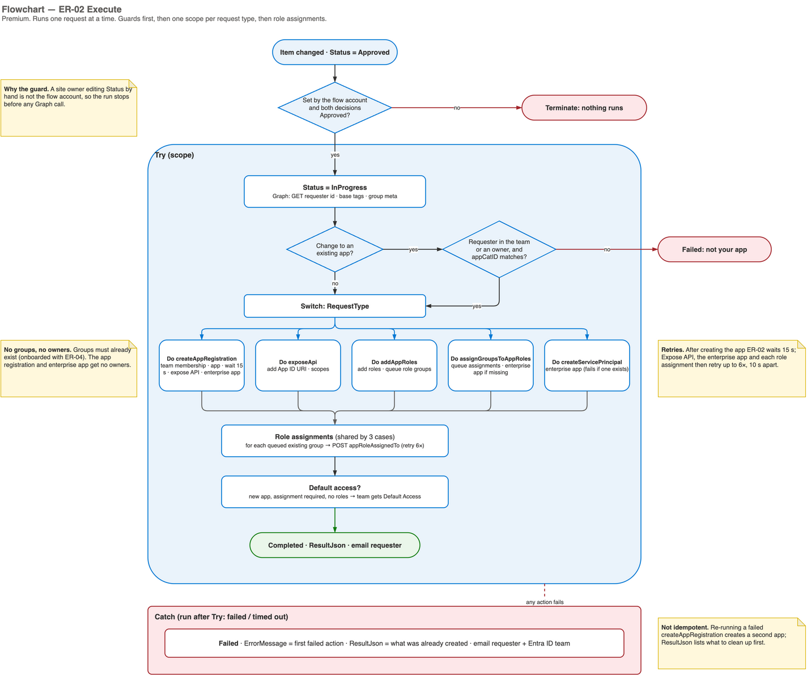

### 4.3 Add an existing group (ER-04)

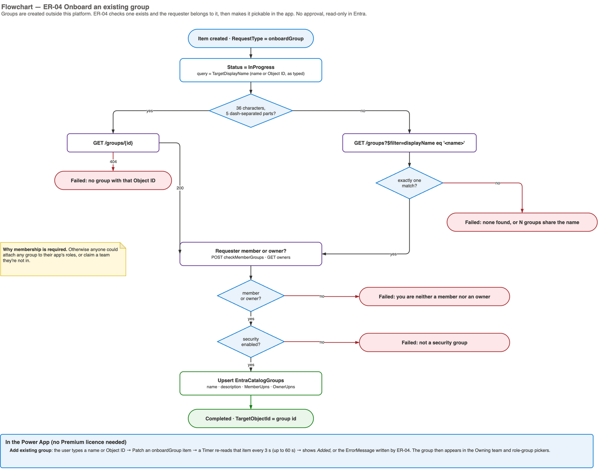

The app shows the result within seconds without a Premium licence. It writes a request item, and a timer re-reads that item until ER-04 has marked it *Completed* or *Failed*. A failure is shown with its reason, for example "You are neither a member nor an owner of …".

## 5. Security

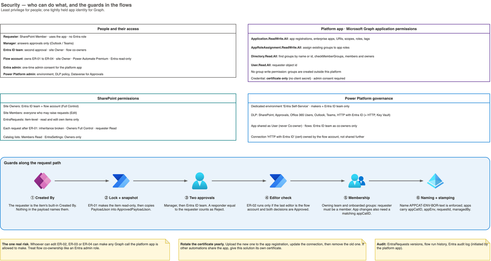

| Guard | How |
|---|---|
| **Requester identity can't be faked** | It is the list item's built-in *Created By*. No payload field names the requester. |
| **What was approved is what runs** | ER-01 locks the item before snapshotting it into `ApprovedPayloadJson`, and ER-02 executes only that snapshot. |
| **Two approvals, no self-approval** | The manager, then the Entra ID team. A responder who is the requester counts as Reject. |
| **Only the flow can release a request** | ER-02 checks that the last editor is the flow account and both decisions are *Approved*. |
| **Teams own their apps** | The requester must be a member of the owning team. Changes to an existing app also need membership and a matching appCatID. |
| **Groups can't be hijacked** | Only groups the requester is a member or owner of can be onboarded, and they must be security groups. |
| **Least privilege** | No people get Entra roles. The app has no group-write permission and uses a **certificate only** (no client secret). |
| **Naming and tagging** | Display name `<AppCatID>-<Env>-<BoR short name>-<text>`, plus tags `appCatID`, `appEnv`, `borShortName`, `team`, `createdBy`, `requestId` and `managedBy`. |

**Residual risk:** anyone who can **edit** ER-02, ER-03 or ER-04 can use the Graph connection. So:

- keep the flows in a dedicated environment;
- allow only the Entra ID team as co-owners;
- treat flow co-ownership like an admin role.

## 6. Constraints and assumptions

| Area | Constraint |
|---|---|
| **Licensing** | ER-02, ER-03 and ER-04 use a Premium connector, so the **flow account** needs one Power Automate Premium licence. App users need nothing beyond Microsoft 365, because the app never calls a Premium flow directly. |
| **Environment** | The Approvals connector needs a Power Platform environment **with Dataverse** (the default environment usually has one). Importing the solution also needs Dataverse. |
| **Groups** | Groups are **not created** here. The owning team and role groups must already exist, be **security-enabled**, and be onboarded by someone who is a member or owner. |
| **Owners** | App registrations and enterprise apps get **no owners**. Owning teams manage them through this platform only. Credentials (certificates, federated credentials) must be added by the Entra ID team or a separate process. |
| **Naming** | `AppCatID` and the BoR short name are typed by the requester (validated by pattern). They aren't yet looked up from the book of record (see §8.2). |
| **Entra replication** | New objects take seconds to replicate. ER-02 waits and retries, but under heavy load a step can still fail after 6 attempts. The request then fails cleanly with what was created. |
| **Not idempotent** | Re-running a failed *new app* request creates a second app. Clean up the objects listed in ResultJson first. |
| **Throttling** | The Graph connection allows about 100 calls per minute. That is ample for request volumes, but ER-03 slows down when there are many hundreds of apps or groups. |
| **SharePoint as the store** | Each locked request has unique permissions. Microsoft recommends far fewer than the 50,000-per-list hard limit, so archive old requests yearly. Views over 5,000 items rely on the indexed columns. |
| **Single tenant** | Apps are created in the tenant the flows run in. Another tenant needs its own platform app and environment. |
| **Approvals** | A Power Automate approval waits at most 30 days (the flow run limit). Unanswered requests then expire and must be resubmitted. |
| **Connection health** | The connections belong to the flow account. Password changes, or Conditional Access sign-in frequency on that account, can break them. Monitor flow failures. |
| **Certificate** | Expires yearly. Upload the new one to the app registration, update the connection, then remove the old one. |
| **Service principal type** | `servicePrincipalType` can't be set through Graph. It is always *Application* for an enterprise app created from an app registration. |

## 7. Cost and benefit

### 7.1 Per request

| | Manual today | Self-service |
|---|---|---|
| **Lead time** | ~10 working days | Approval time plus about 1–2 minutes of flow time. Typically **the same day**, depending on how quickly the two approvers respond. |
| **Entra ID team effort** | ≥ 1 person-day (8 h) | About **5 minutes** to review and approve. Nothing to build. |
| **Requester effort** | Ticket, clarifications, follow-ups | About **10–15 minutes** to fill in the form |
| **Manager effort** | Ad hoc | About 2 minutes to approve |
| **Consistency** | Varies by engineer | Identical every time: naming, tags, settings |
| **Audit** | Scattered across tickets and email | One list item per request, with versions, approvals, who/when and the result IDs |

**Saving per request:** about **7.9 hours of Entra ID team effort** (8 h minus about 5 min of review), and the lead time drops by roughly **9 working days**.

### 7.2 Per year (illustrative)

The Entra ID team's effort saved, assuming 220 working days a year:

| New app registrations per year | Person-days saved | Full-time equivalent freed |
|---|---|---|
| 50 | ≈ 49 | ≈ 0.2 FTE |
| 100 | ≈ 99 | ≈ 0.45 FTE |
| 200 | ≈ 198 | ≈ 0.9 FTE |

To get a money figure, multiply the person-days by your internal day rate. Change requests to existing apps (scopes, roles, group assignments) are typically smaller manual tasks, but they add to the saving.

### 7.3 Running cost

| Item | Cost |
|---|---|
| Power Automate Premium for the flow account | **One user licence** (list price about US$15 per user/month at the time of writing; check your agreement) |
| Power Apps, SharePoint, Approvals, Outlook | Included in existing Microsoft 365 licences |
| Azure | None (no subscription, Key Vault or hosting needed with the recommended connection option) |
| Maintenance | Yearly certificate rotation; occasional flow updates, imported as a new solution version |

Even at the lowest volume (50 apps a year, ~49 person-days saved), one Premium licence costs a small fraction of the effort it saves.

## 8. Future extensions

### 8.1 ServiceNow: raise a normal change automatically after approval

*Not built yet.* These diagrams live in [`diagrams/entra-powerplatform-future.drawio`](../diagrams/entra-powerplatform-future.drawio) and are kept out of the main set on purpose.

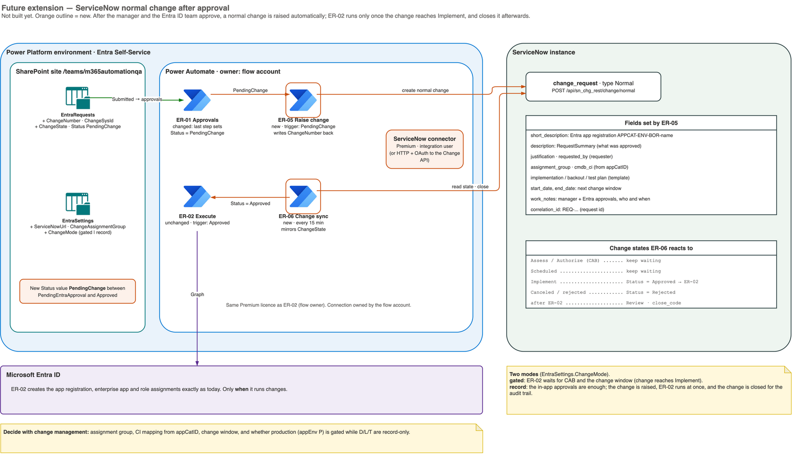

**What changes**

| Area | Change |
|---|---|
| **ER-01** | Its last step sets Status = **PendingChange** instead of *Approved*. |
| **ER-05 Raise change** (new) | Triggered by PendingChange. Creates a ServiceNow **normal change**, either with the ServiceNow connector or with `POST /api/sn_chg_rest/change/normal`. The change includes:<ul><li>a short description with the app name;</li><li>the approved request summary as its description;</li><li>justification and requested-by;</li><li>assignment group, and the CMDB CI from the appCatID;</li><li>implementation, backout and test plans from a template;</li><li>the next change window;</li><li>the two in-app approvals as work notes;</li><li>`correlation_id` = the request ID.</li></ul>It stores ChangeNumber and ChangeSysId on the request and emails the requester the change number. |
| **ER-06 Change sync** (new) | Runs every 15 minutes and mirrors the change state onto the request:<ul><li>*Implement*: sets Status = Approved, which starts ER-02 unchanged;</li><li>*Canceled* or rejected: sets Status = Rejected;</li><li>after ER-02 finishes: adds ResultJson as work notes, moves the change to Review with close code *successful* or *unsuccessful*, and closes it.</li></ul> |
| **SharePoint** | New EntraRequests columns: ChangeNumber, ChangeSysId and ChangeState, plus the Status value PendingChange. New EntraSettings fields: ServiceNowUrl, ChangeAssignmentGroup and ChangeMode. |
| **Connection** | A ServiceNow integration user (with change-write rights only), owned by the flow account. It is covered by the same Premium licence. |

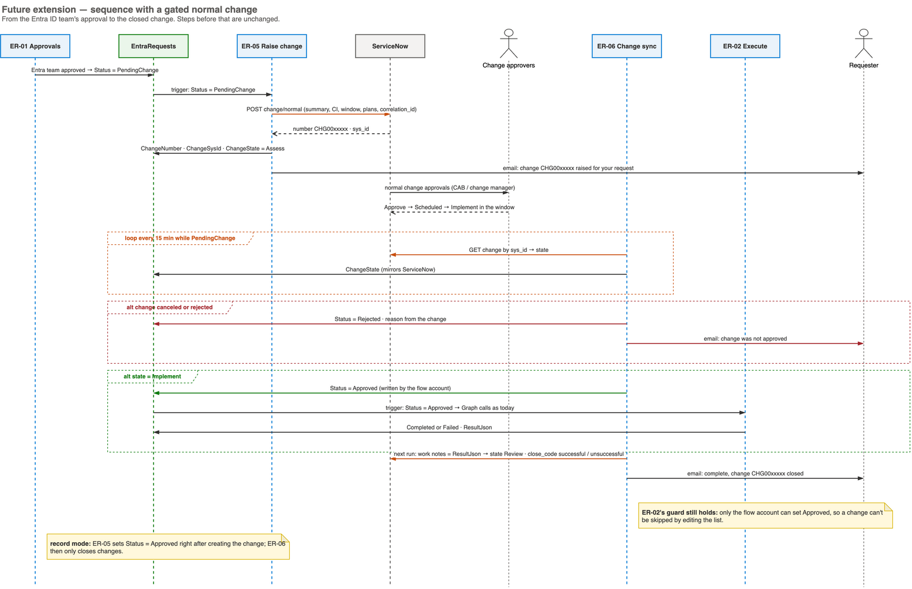

**Two modes** (`EntraSettings.ChangeMode`):

- **gated:** ER-02 waits for CAB approval and the change window, i.e. until the change reaches *Implement*.
- **record:** the in-app approvals are enough. The change is raised, ER-02 runs at once, and the change is closed automatically as a record.

A common mix is to gate production (`appEnv` P) and record everything else.

**To agree with change management before building:**

- the assignment group;
- how appCatID maps to a CMDB CI;
- the change template (plans and risk);
- the change window;
- which environments are gated.

**Effort estimate:** two new flows, one changed step in ER-01 and a few list columns. The ER-02 logic and the app are unchanged, apart from showing the change number under *My requests*.

### 8.2 Other candidates

- **Book-of-record lookup:** pick the appCatID from the CMDB or business-application list and fill the BoR short name automatically, instead of typing both.
- **Credential requests:** upload a certificate or add a federated credential (for example GitHub or Azure DevOps OIDC) through the same approval path. Still no client secrets.
- **Decommission:** disable, then delete, an app registration and its enterprise app, with the same approvals.
- **Periodic review:** a yearly prompt to each owning team to confirm its apps are still needed.
- **Teams notifications and adaptive cards** for approvers and requesters.

## 9. Where to find things

| Need | Where |
|---|---|
| All diagrams (editable, 14 pages) | [`diagrams/entra-powerplatform.drawio`](../diagrams/entra-powerplatform.drawio) · [PDF](../diagrams/entra-powerplatform.pdf) |
| Future extension diagrams | [`diagrams/entra-powerplatform-future.drawio`](../diagrams/entra-powerplatform-future.drawio) · [PDF](../diagrams/entra-powerplatform-future.pdf) |
| Entra setup (app registration, permissions, certificate) | [01-ENTRA.md](01-ENTRA.md) |
| SharePoint lists | [02-SHAREPOINT.md](02-SHAREPOINT.md) |
| Power App | [03-POWER-APPS.md](03-POWER-APPS.md) |
| Flows, step by step | [04-POWER-AUTOMATE.md](04-POWER-AUTOMATE.md) |
| Import the flows as a solution | [09-SOLUTION-IMPORT.md](09-SOLUTION-IMPORT.md) |
| Test guides | [06](06-TEST-ER01.md) · [07](07-TEST-ER02.md) · [08](08-TEST-ER03.md) · [10](10-TEST-ER04.md) |
